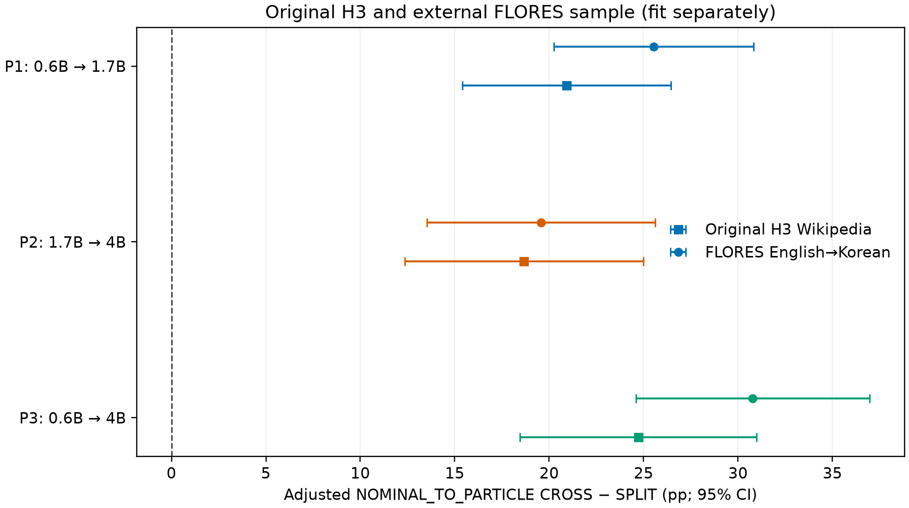

FLORES-200 English→Korean replication: REPLICATED — the Nominal→Particle CROSS−SPLIT association is positive in all three model pairs, in the pooled estimate, and relative to the lexical-boundary environment.

## Data and execution

Original FLORES-200 devtest: **1,012** paired rows, all included in source order. Archive SHA-256 `b8b0b76783024b85797e5cc75064eb83fc5288b41e9654dabc7be6ae944011f6`; English file `612e9fbe87997617c0fa8fa8929654a4f49b728d96738112c2b86ef6a1d78d88`; Korean provenance file `540972696230a56e888f1fbd04b7000135c436351f5e467f99ce67fdccd8df0f`. See `data_manifest.csv`, `data_manifest.sha256`, and `prompt_audit.md`.
GPU execution used physical GPU 3 (A100-SXM4-80GB), process-visible as `cuda:0` with `CUDA_VISIBLE_DEVICES=3`. Full hardware/software evidence and peak memory are in `flores_config.json`; runtime checkpoints are prompt-resumable.

## Speculative-decoding and alignment validity

| pair | prompts | generated_tokens | sd_valid_output_tokens | sd_invalid_output_tokens | invalidated_sd_proposals | target_sd_exact_prompt_count | target_sd_mismatch_prompt_count | cross_eojeol_excluded | kiwi_complex_excluded | cross_kiwi_exclusion_percent | exact_span_rows | visible_non_special_tokens | alignment_success_percent_visible | alignment_failures | retokenization_exact_prompts | retokenization_fallback_prompts |
| --- | --- | --- | --- | --- | --- | --- | --- | --- | --- | --- | --- | --- | --- | --- | --- | --- |
| P1 | 1012.000 | 50454.000 | 50454.000 | 0.000 | 32910.000 | 1012.000 | 0.000 | 0.000 | 4225.000 | 8.374 | 49411.000 | 49508.000 | 99.804 | 97.000 | 967.000 | 45.000 |
| P2 | 1012.000 | 46523.000 | 46523.000 | 0.000 | 19850.000 | 1012.000 | 0.000 | 0.000 | 3870.000 | 8.318 | 45493.000 | 45532.000 | 99.914 | 39.000 | 994.000 | 18.000 |
| P3 | 1012.000 | 46523.000 | 46523.000 | 0.000 | 30430.000 | 1012.000 | 0.000 | 0.000 | 3870.000 | 8.318 | 45493.000 | 45532.000 | 99.914 | 39.000 | 994.000 | 18.000 |

Output language audit: | pair | outputs | predominantly_korean | hangul_share_mean | hangul_share_median | predominantly_korean_percent |
| --- | --- | --- | --- | --- | --- |
| P1 | 1012.000 | 973.000 | 0.944 | 1.000 | 96.146 |
| P2 | 1012.000 | 858.000 | 0.828 | 1.000 | 84.783 |
| P3 | 1012.000 | 858.000 | 0.828 | 1.000 | 84.783 |

All target and SD token IDs matched exactly for the analyzed prompts; no prompt was removed for language or translation quality. Alignment used E2's H2 tokenizer offset and Kiwi pipeline. `population_audit.csv` and `morphology_environment_counts.csv` retain the full counts.

## Contextual fragmentation result

Prompt-cluster bootstrap estimates reproduce H2's exact fragmentation categories (2, 3, 4, 5, 6, 7, 8+) with 2,000 resamples and seed 3090.
| pair | morph_class | fragmentation_bin | n_tokens | n_prompts | rejection_rate | bootstrap_ci_low | bootstrap_ci_high |
| --- | --- | --- | --- | --- | --- | --- | --- |
| P1 | EXACT | 2 | 5117.000 | 906.000 | 0.291 | 0.274 | 0.308 |
| P1 | EXACT | 3 | 5130.000 | 940.000 | 0.268 | 0.247 | 0.287 |
| P1 | EXACT | 4 | 3083.000 | 830.000 | 0.254 | 0.237 | 0.271 |
| P1 | EXACT | 5 | 1591.000 | 576.000 | 0.286 | 0.259 | 0.315 |
| P1 | EXACT | 6 | 666.000 | 303.000 | 0.291 | 0.257 | 0.328 |
| P1 | EXACT | 7 | 255.000 | 134.000 | 0.322 | 0.265 | 0.382 |
| P1 | EXACT | 8+ | 223.000 | 83.000 | 0.341 | 0.268 | 0.415 |
| P1 | WITHIN_SPLIT | 2 | 2108.000 | 625.000 | 0.389 | 0.359 | 0.418 |
| P1 | WITHIN_SPLIT | 3 | 7418.000 | 951.000 | 0.355 | 0.337 | 0.372 |
| P1 | WITHIN_SPLIT | 4 | 6252.000 | 865.000 | 0.318 | 0.302 | 0.335 |
| P1 | WITHIN_SPLIT | 5 | 4600.000 | 633.000 | 0.300 | 0.278 | 0.323 |
| P1 | WITHIN_SPLIT | 6 | 2237.000 | 326.000 | 0.337 | 0.303 | 0.372 |
| P1 | WITHIN_SPLIT | 7 | 1018.000 | 150.000 | 0.348 | 0.301 | 0.395 |
| P1 | WITHIN_SPLIT | 8+ | 839.000 | 87.000 | 0.333 | 0.279 | 0.390 |
| P1 | CROSS_MORPHEME | 2 | 1062.000 | 567.000 | 0.357 | 0.326 | 0.388 |
| P1 | CROSS_MORPHEME | 3 | 724.000 | 470.000 | 0.442 | 0.406 | 0.482 |
| P1 | CROSS_MORPHEME | 4 | 364.000 | 276.000 | 0.393 | 0.339 | 0.447 |
| P1 | CROSS_MORPHEME | 5 | 145.000 | 127.000 | 0.448 | 0.372 | 0.531 |
| P1 | CROSS_MORPHEME | 6 | 35.000 | 34.000 | 0.514 | 0.344 | 0.667 |
| P1 | CROSS_MORPHEME | 7 | 12.000 | 12.000 | 0.583 | 0.286 | 0.875 |
| P1 | CROSS_MORPHEME | 8+ | 14.000 | 12.000 | 0.714 | 0.417 | 1.000 |
| P2 | EXACT | 2 | 4436.000 | 899.000 | 0.240 | 0.225 | 0.254 |
| P2 | EXACT | 3 | 4649.000 | 869.000 | 0.206 | 0.192 | 0.221 |
| P2 | EXACT | 4 | 2564.000 | 747.000 | 0.214 | 0.197 | 0.231 |
| P2 | EXACT | 5 | 1255.000 | 524.000 | 0.217 | 0.192 | 0.241 |
| P2 | EXACT | 6 | 534.000 | 254.000 | 0.217 | 0.184 | 0.252 |
| P2 | EXACT | 7 | 204.000 | 113.000 | 0.221 | 0.167 | 0.277 |
| P2 | EXACT | 8+ | 214.000 | 76.000 | 0.252 | 0.196 | 0.306 |
| P2 | WITHIN_SPLIT | 2 | 2181.000 | 696.000 | 0.234 | 0.215 | 0.253 |
| P2 | WITHIN_SPLIT | 3 | 7184.000 | 898.000 | 0.239 | 0.226 | 0.252 |
| P2 | WITHIN_SPLIT | 4 | 5581.000 | 784.000 | 0.223 | 0.210 | 0.235 |
| P2 | WITHIN_SPLIT | 5 | 3552.000 | 566.000 | 0.206 | 0.189 | 0.223 |
| P2 | WITHIN_SPLIT | 6 | 1775.000 | 297.000 | 0.229 | 0.206 | 0.253 |
| P2 | WITHIN_SPLIT | 7 | 805.000 | 126.000 | 0.226 | 0.185 | 0.268 |
| P2 | WITHIN_SPLIT | 8+ | 685.000 | 82.000 | 0.171 | 0.135 | 0.211 |
| P2 | CROSS_MORPHEME | 2 | 991.000 | 601.000 | 0.244 | 0.217 | 0.271 |
| P2 | CROSS_MORPHEME | 3 | 630.000 | 427.000 | 0.289 | 0.254 | 0.324 |
| P2 | CROSS_MORPHEME | 4 | 298.000 | 239.000 | 0.312 | 0.258 | 0.365 |
| P2 | CROSS_MORPHEME | 5 | 132.000 | 114.000 | 0.333 | 0.252 | 0.411 |
| P2 | CROSS_MORPHEME | 6 | 50.000 | 48.000 | 0.480 | 0.340 | 0.617 |
| P2 | CROSS_MORPHEME | 7 | 16.000 | 15.000 | 0.375 | 0.154 | 0.611 |
| P2 | CROSS_MORPHEME | 8+ | 21.000 | 15.000 | 0.571 | 0.412 | 0.750 |
| P3 | EXACT | 2 | 4436.000 | 899.000 | 0.317 | 0.301 | 0.332 |
| P3 | EXACT | 3 | 4649.000 | 869.000 | 0.288 | 0.273 | 0.305 |
| P3 | EXACT | 4 | 2564.000 | 747.000 | 0.284 | 0.266 | 0.302 |
| P3 | EXACT | 5 | 1255.000 | 524.000 | 0.287 | 0.261 | 0.313 |
| P3 | EXACT | 6 | 534.000 | 254.000 | 0.328 | 0.286 | 0.370 |
| P3 | EXACT | 7 | 204.000 | 113.000 | 0.328 | 0.269 | 0.392 |
| P3 | EXACT | 8+ | 214.000 | 76.000 | 0.369 | 0.308 | 0.430 |
| P3 | WITHIN_SPLIT | 2 | 2181.000 | 696.000 | 0.385 | 0.361 | 0.408 |
| P3 | WITHIN_SPLIT | 3 | 7184.000 | 898.000 | 0.371 | 0.355 | 0.387 |
| P3 | WITHIN_SPLIT | 4 | 5581.000 | 784.000 | 0.342 | 0.327 | 0.356 |
| P3 | WITHIN_SPLIT | 5 | 3552.000 | 566.000 | 0.319 | 0.299 | 0.341 |
| P3 | WITHIN_SPLIT | 6 | 1775.000 | 297.000 | 0.325 | 0.297 | 0.355 |
| P3 | WITHIN_SPLIT | 7 | 805.000 | 126.000 | 0.293 | 0.255 | 0.334 |
| P3 | WITHIN_SPLIT | 8+ | 685.000 | 82.000 | 0.288 | 0.235 | 0.347 |
| P3 | CROSS_MORPHEME | 2 | 991.000 | 601.000 | 0.350 | 0.319 | 0.382 |
| P3 | CROSS_MORPHEME | 3 | 630.000 | 427.000 | 0.416 | 0.378 | 0.455 |
| P3 | CROSS_MORPHEME | 4 | 298.000 | 239.000 | 0.423 | 0.371 | 0.480 |
| P3 | CROSS_MORPHEME | 5 | 132.000 | 114.000 | 0.455 | 0.364 | 0.538 |
| P3 | CROSS_MORPHEME | 6 | 50.000 | 48.000 | 0.580 | 0.444 | 0.711 |
| P3 | CROSS_MORPHEME | 7 | 16.000 | 15.000 | 0.500 | 0.250 | 0.737 |
| P3 | CROSS_MORPHEME | 8+ | 21.000 | 15.000 | 0.667 | 0.467 | 0.909 |

## CROSS versus WITHIN_SPLIT

M1/M2/M3 use the exact H2/E2 eligibility, structural controls, full-sequence entropy, and prompt-clustered covariance; M5 adds the unchanged E1 cubic spline token-frequency term.
| pair | model | n_tokens | n_prompts | cross_coefficient | odds_ratio | or_ci_low | or_ci_high | p_value | status |
| --- | --- | --- | --- | --- | --- | --- | --- | --- | --- |
| P1 | M1 | 26828.000 | 1010.000 | 0.215 | 1.240 | 1.126 | 1.366 | 0.000 | fit |
| P1 | M2 | 26828.000 | 1010.000 | 1.184 | 3.267 | 2.716 | 3.930 | 0.000 | fit |
| P1 | M3 | 26828.000 | 1010.000 | 0.824 | 2.280 | 1.913 | 2.717 | 0.000 | fit |
| P1 | M4 | 26828.000 | 1010.000 | 0.892 | 2.440 | 2.032 | 2.930 | 0.000 | fit |
| P1 | M5 | 26828.000 | 1010.000 | 0.728 | 2.072 | 1.686 | 2.545 | 0.000 | fit |
| P2 | M1 | 23901.000 | 1012.000 | 0.302 | 1.352 | 1.211 | 1.510 | 0.000 | fit |
| P2 | M2 | 23901.000 | 1012.000 | 1.324 | 3.759 | 3.176 | 4.449 | 0.000 | fit |
| P2 | M3 | 23901.000 | 1012.000 | 0.893 | 2.443 | 2.030 | 2.939 | 0.000 | fit |
| P2 | M4 | 23901.000 | 1012.000 | 0.919 | 2.506 | 2.081 | 3.017 | 0.000 | fit |
| P2 | M5 | 23901.000 | 1012.000 | 0.752 | 2.121 | 1.699 | 2.648 | 0.000 | fit |
| P3 | M1 | 23901.000 | 1012.000 | 0.161 | 1.174 | 1.064 | 1.295 | 0.001 | fit |
| P3 | M2 | 23901.000 | 1012.000 | 1.531 | 4.623 | 3.893 | 5.489 | 0.000 | fit |
| P3 | M3 | 23901.000 | 1012.000 | 1.018 | 2.767 | 2.291 | 3.343 | 0.000 | fit |
| P3 | M4 | 23901.000 | 1012.000 | 1.066 | 2.905 | 2.394 | 3.524 | 0.000 | fit |
| P3 | M5 | 23901.000 | 1012.000 | 0.908 | 2.478 | 1.971 | 3.117 | 0.000 | fit |

## H3 environment analysis

The environment audit retains all five prespecified categories. Single-boundary eligibility and local-adjacent SPLIT assignment are unchanged. The pooled H3 interaction omnibus p-value is `1.8787785357334528e-20`.
### Nominal→Particle pair-specific AMEs

| pair | ame | ame_ci_low | ame_ci_high | n_cross | n_split | n_prompts | p_value | p_holm_within_pair | ame_minus_lexical | ame_minus_lexical_ci_low | ame_minus_lexical_ci_high |
| --- | --- | --- | --- | --- | --- | --- | --- | --- | --- | --- | --- |
| P1 | 25.540 | 20.259 | 30.822 | 239.000 | 9322.000 | 966.000 | 0.000 | 0.000 | 17.526 | 6.989 | 28.063 |
| P2 | 19.571 | 13.535 | 25.606 | 176.000 | 7902.000 | 872.000 | 0.000 | 0.000 | 13.242 | 3.703 | 22.781 |
| P3 | 30.777 | 24.588 | 36.965 | 176.000 | 7902.000 | 872.000 | 0.000 | 0.000 | 14.178 | 4.244 | 24.111 |

Pooled all-eligible-prompt Nominal→Particle AME: | environment | n_rows | n_cross | n_split | n_prompts | adjusted_p_cross | adjusted_p_split | ame | ame_ci_low | ame_ci_high | p_value |
| --- | --- | --- | --- | --- | --- | --- | --- | --- | --- | --- |
| NOMINAL_TO_PARTICLE | 25717.0000 | 591.0000 | 25126.0000 | 992.0000 | 0.5743 | 0.3187 | 0.2556 | 0.2171 | 0.2941 | 0.0000 |

### All planned environment contrasts

| pair | environment | n_cross | n_split | n_prompts | ame | ame_ci_low | ame_ci_high | p_value | p_holm_within_pair | omnibus_interaction_p |
| --- | --- | --- | --- | --- | --- | --- | --- | --- | --- | --- |
| P1 | NOMINAL_TO_PARTICLE | 239.000 | 9322.000 | 966.000 | 0.255 | 0.203 | 0.308 | 0.000 | 0.000 | 0.000 |
| P1 | PREDICATE_TO_ENDING | 628.000 | 1080.000 | 562.000 | 0.143 | 0.092 | 0.195 | 0.000 | 0.000 | 0.000 |
| P1 | ENDING_TO_ENDING | 70.000 | 28.000 | 90.000 | 0.098 | -0.119 | 0.314 | 0.376 | 0.376 | 0.000 |
| P1 | LEXICAL_TO_LEXICAL | 75.000 | 6058.000 | 865.000 | 0.080 | -0.021 | 0.181 | 0.121 | 0.242 | 0.000 |
| P1 | OTHER | 1263.000 | 7984.000 | 961.000 | 0.055 | 0.025 | 0.086 | 0.000 | 0.001 | 0.000 |
| P2 | NOMINAL_TO_PARTICLE | 176.000 | 7902.000 | 872.000 | 0.196 | 0.135 | 0.256 | 0.000 | 0.000 | 0.000 |
| P2 | PREDICATE_TO_ENDING | 494.000 | 838.000 | 489.000 | 0.089 | 0.033 | 0.144 | 0.002 | 0.005 | 0.000 |
| P2 | ENDING_TO_ENDING | 51.000 | 35.000 | 73.000 | 0.109 | -0.043 | 0.260 | 0.160 | 0.248 | 0.000 |
| P2 | LEXICAL_TO_LEXICAL | 139.000 | 5532.000 | 863.000 | 0.063 | -0.017 | 0.144 | 0.124 | 0.248 | 0.000 |
| P2 | OTHER | 1192.000 | 7456.000 | 940.000 | 0.072 | 0.041 | 0.102 | 0.000 | 0.000 | 0.000 |
| P3 | NOMINAL_TO_PARTICLE | 176.000 | 7902.000 | 872.000 | 0.308 | 0.246 | 0.370 | 0.000 | 0.000 | 0.000 |
| P3 | PREDICATE_TO_ENDING | 494.000 | 838.000 | 489.000 | 0.111 | 0.054 | 0.167 | 0.000 | 0.000 | 0.000 |
| P3 | ENDING_TO_ENDING | 51.000 | 35.000 | 73.000 | 0.055 | -0.146 | 0.256 | 0.592 | 0.592 | 0.000 |
| P3 | LEXICAL_TO_LEXICAL | 139.000 | 5532.000 | 863.000 | 0.166 | 0.079 | 0.253 | 0.000 | 0.000 | 0.000 |
| P3 | OTHER | 1192.000 | 7456.000 | 940.000 | 0.098 | 0.065 | 0.131 | 0.000 | 0.000 | 0.000 |

The plotted adjusted effects appear in `figures/environment_ame_forest.png` and `.pdf`; numerical source is `results/environment_pair_results.csv`.

## Original versus FLORES comparison

The original Wikipedia and FLORES samples were fitted separately; they are shown side-by-side and were not pooled.
| pair | ame_pp | ame_ci_low_pp | ame_ci_high_pp | n_cross | n_split | p_value | sample | n_prompts |
| --- | --- | --- | --- | --- | --- | --- | --- | --- |
| P1 | 20.924 | 15.415 | 26.434 | 212.000 | 22211.000 | 0.000 | Original H3 Wikipedia |  |
| P2 | 18.672 | 12.370 | 24.975 | 212.000 | 22014.000 | 0.000 | Original H3 Wikipedia |  |
| P3 | 24.715 | 18.445 | 30.985 | 218.000 | 21829.000 | 0.000 | Original H3 Wikipedia |  |
| P1 | 25.540 | 20.259 | 30.822 | 239.000 | 9322.000 | 0.000 | FLORES English→Korean | 966.000 |
| P2 | 19.571 | 13.535 | 25.606 | 176.000 | 7902.000 | 0.000 | FLORES English→Korean | 872.000 |
| P3 | 30.777 | 24.588 | 36.965 | 176.000 | 7902.000 | 0.000 | FLORES English→Korean | 872.000 |

## Nominal→Particle frequency robustness

H4 L1/L2/L3 were run with the existing tokenizer-compatible E1/H4 caches from the same Korean Wikipedia corpus. They add particle/nominal controls and then nonlinear nominal, particle, and eojeol frequencies; these are robustness controls, not mediation estimates.
| pair | L1_AME_pp | L2_AME_pp | L3_AME_pp | L1_to_L3_change_pp | L3_ci_low_pp | L3_ci_high_pp | L3_p | n_tokens | n_prompts |
| --- | --- | --- | --- | --- | --- | --- | --- | --- | --- |
| P1 | 14.898 | 18.623 | 21.356 | 6.457 | 4.627 | 38.085 | 0.012 | 9554.000 | 966.000 |
| P2 | 4.537 | 9.986 | 8.562 | 4.026 | -7.820 | 24.945 | 0.306 | 8073.000 | 872.000 |
| P3 | 13.019 | 16.170 | 19.498 | 6.480 | -8.815 | 47.812 | 0.177 | 8073.000 | 872.000 |

## Token-identity concentration

Exact `(nominal surface, particle surface, token surface)` patterns are ranked by counts only, without using rejection labels. Concentration statistics describe the top 1/5/10 patterns within N→P CROSS tokens.
| pair | top_k_patterns | patterns_available | patterns_in_top_k | total_cross_tokens | top_k_cross_tokens | share_of_cross_tokens | top_k_raw_rejection | top_k_share_of_rejected_cross | ranked_by |
| --- | --- | --- | --- | --- | --- | --- | --- | --- | --- |
| P1 | 1.000 | 131.000 | 1.000 | 234.000 | 17.000 | 0.073 | 0.000 | 0.000 | n_cross only; no outcome-based ranking |
| P1 | 5.000 | 131.000 | 5.000 | 234.000 | 54.000 | 0.231 | 0.148 | 0.064 | n_cross only; no outcome-based ranking |
| P1 | 10.000 | 131.000 | 10.000 | 234.000 | 78.000 | 0.333 | 0.269 | 0.168 | n_cross only; no outcome-based ranking |
| P2 | 1.000 | 125.000 | 1.000 | 171.000 | 7.000 | 0.041 | 0.000 | 0.000 | n_cross only; no outcome-based ranking |
| P2 | 5.000 | 125.000 | 5.000 | 171.000 | 21.000 | 0.123 | 0.190 | 0.066 | n_cross only; no outcome-based ranking |
| P2 | 10.000 | 125.000 | 10.000 | 171.000 | 36.000 | 0.211 | 0.222 | 0.131 | n_cross only; no outcome-based ranking |
| P3 | 1.000 | 125.000 | 1.000 | 171.000 | 7.000 | 0.041 | 0.000 | 0.000 | n_cross only; no outcome-based ranking |
| P3 | 5.000 | 125.000 | 5.000 | 171.000 | 21.000 | 0.123 | 0.286 | 0.055 | n_cross only; no outcome-based ranking |
| P3 | 10.000 | 125.000 | 10.000 | 171.000 | 36.000 | 0.211 | 0.472 | 0.155 | n_cross only; no outcome-based ranking |

## Common-prompt sensitivity

The exact three-way intersection has **1,010 eligible prompt IDs**. Common-only pooled N→P AME differs from the all-eligible pooled estimate by at most 0.01 pp; classification: **unchanged**. See `results/common_prompt_sensitivity.md` and `audits/common_prompt_intersection.json`.

## Diagnostics and limitations

Model convergence, rank, sparse cells, warning/separation signals, extreme coefficients, frequency joins, and cluster counts are documented in `audits/diagnostics.md` and its JSON record. Environment and H4 categories below their prespecified support are retained and interpreted as imprecise. No unusual or non-Korean output was excluded.
This study changes the workload from free-form continuation of Korean Wikipedia text to English→Korean translation using the same base models and generation protocol. Translation prompts and generated linguistic constructions therefore differ from the original study; external validity is limited to this benchmark/task setting. The historical P3 0.6B draft revision remains unresolved; this run pins the E2 commit and reports that limitation.

### Paper-ready interpretation

On FLORES-200 English→Korean, the adjusted association between crossing a morpheme boundary and speculative rejection was positive in all three model pairs. The Nominal→Particle environment showed a directionally larger penalty than lexical-to-lexical boundaries across pairs. Frequency controls and token-pattern concentration are reported as robustness descriptions; they do not identify causal mechanisms. These results test the association on a translation workload and do not establish that Korean morphology causes rejection.
